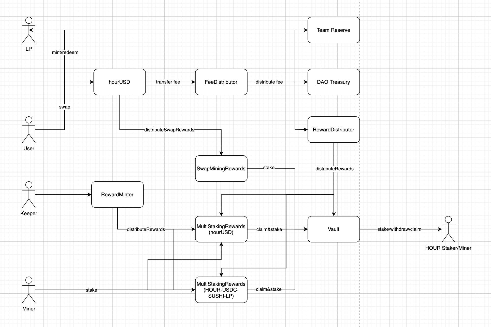

# Hourglass Contracts

Hourglass is a zero-slippage AMM specialized for stablecoin swaps.

## Contract Overview

### Common
Openzeppelin library contracts

### DAO
Contracts for Hourglass DAO. Centered around the `Treasury` which uses a stateless `Converter` for dex interactions.

### Rewards
Contracts for mining and fee distribution. 
- `SwapMiningRewards` distributes rewards on a per swap basis based on the swapped dollar volume.
- `MultiStakingRewards` is a modified SNX style staking reward contract that allows for staking a single token to receive multiple rewards.
- `Vault` is modified SNX style staking reward contract that allows for staking a single token to receive multiple rewards and allows locking of staked token.

### Tokens
The Hourglass Token (HOUR) is a standard mintable and burnable ERC20 token.

### Pools
Implementation of `HourglassPool`, a AMM pool with X + Y = K invariant for swapping equal pegging value tokens.

---

## Contract Addresses

Addresses are categorized by network ID.

[address.js](address.js)
